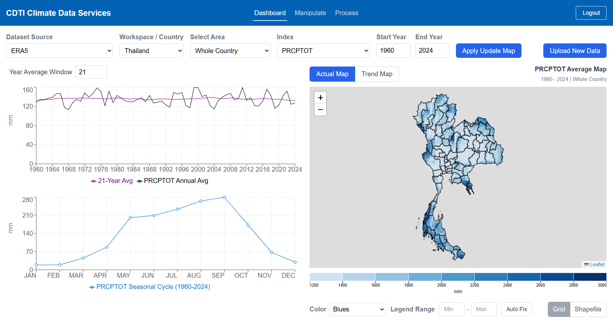
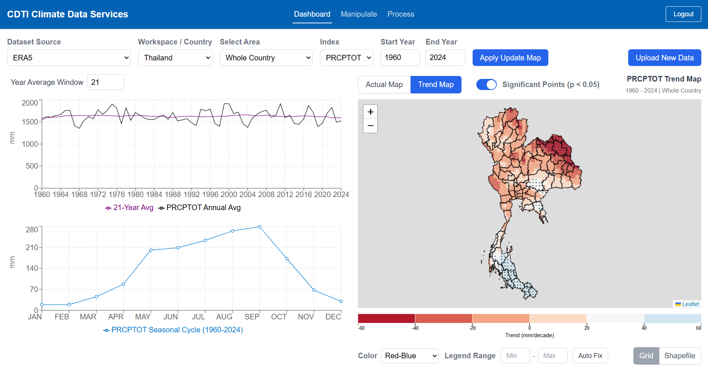
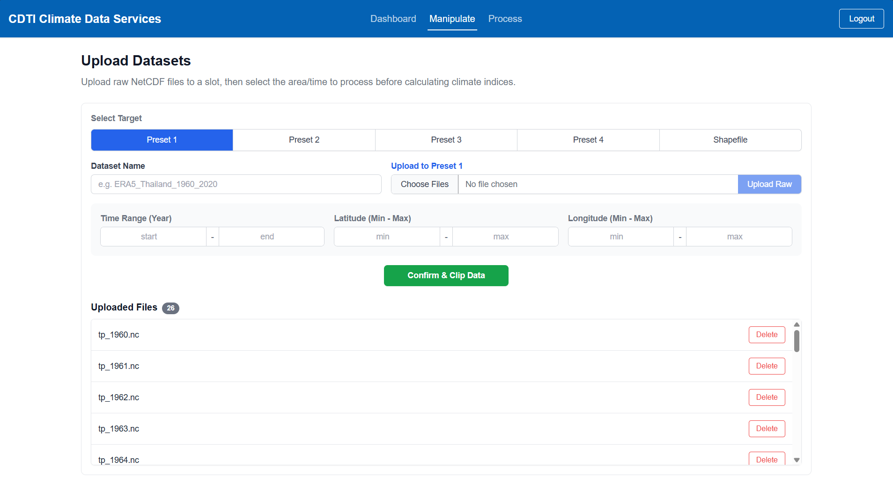
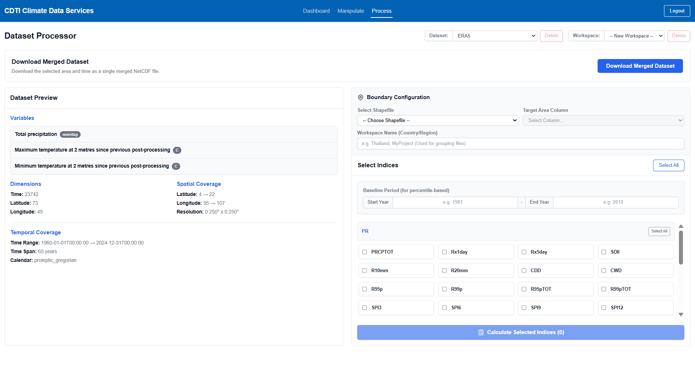
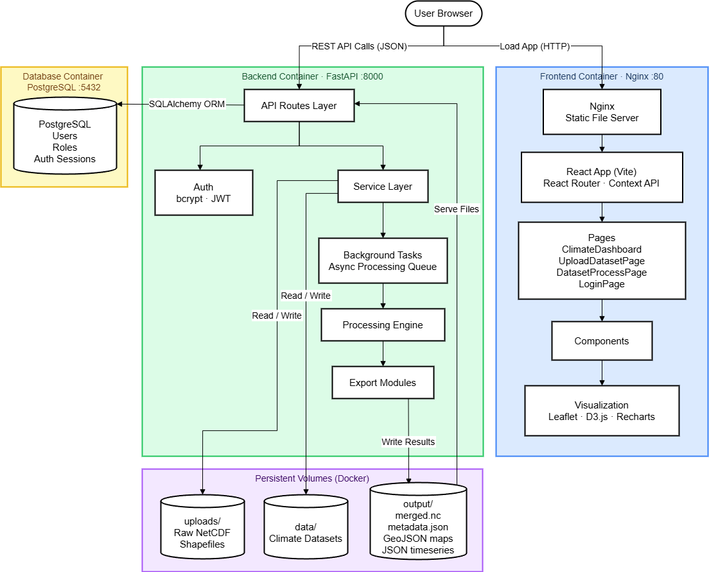

# Climate Data Services — Web Application

A full-stack web application for processing, managing, and visualizing multi-dimensional climate datasets (NetCDF). The platform bridges complex climate data science with accessible interactive mapping and statistical analysis tools.

## Overview

The system provides an end-to-end data pipeline covering raw file ingestion, index computation, geospatial visualization, and role-based access control. It is designed to handle large-scale NetCDF files safely through chunked uploads, and asynchronous background processing.

## Screenshots

### Dashboard — Climate Index Visualization

*Spatial grid map, annual time-series, and seasonal cycle chart.*

<!-- 
*Trend grid map with Theli-Sen slope and Mann-Kendall trend analysis, annual time-series, and seasonal cycle chart.* -->

### Manipulate — Dataset Upload & Management

*Chunked NetCDF upload with time/spatial clipping controls and preset slot management.*

### Process — Index Configuration & Boundary Setup

*Dataset preview, Shapefile boundary configuration, and climate index selection panel.*

## Key Features

- **Chunked Data Ingestion** — Handles large NetCDF uploads without RAM spikes using streaming I/O and lazy loading.
- **Multi-Dimensional Spatiotemporal Filtering** — Supports datasets spanning multiple spatial and temporal dimensions, with flexible selection of custom time ranges, geographic bounding boxes, and administrative boundaries for targeted analysis.
- **Climate Index Computation** — Calculates standard indices (SPI, TXx, PRCPTOT, and more) via `xclim`, with configurable baselines and SPI-event detection.
- **Geospatial Processing** — Spatial clipping to Shapefile boundaries with area-weighted mean calculations.
- **Interactive Visualization** — Spatial grid maps (Leaflet + D3.js) with Mann-Kendall & Theil-Sen Slope for trend maps; time-series and seasonal cycle charts (Recharts).
- **Role-Based Access Control** — `viewer` and `analyst` roles enforced via JWT; protected routes and API endpoints.

---

## Tech Stack

| Layer | Technologies |
|---|---|
| **Frontend** | React (Vite), Tailwind CSS, Leaflet, D3.js, Recharts, React Router, Context API |
| **Backend** | FastAPI, SQLAlchemy ORM, JWT (`python-jose`), bcrypt (`passlib`) |
| **Data Science** | `xarray`, `xclim`, `dask`, `numpy` |
| **Geospatial** | `geopandas`, `rioxarray`, `shapely`, `fiona` |
| **Database** | PostgreSQL |
| **Infrastructure** | Docker, Docker Compose, Nginx |

---

## Architecture

The system is composed of three containerized services orchestrated by Docker Compose.




### Backend Layers

| Layer | Directory | Responsibility |
|---|---|---|
| **API Routes** | `routes/` | Handles HTTP requests, validates JWT, dispatches background tasks |
| **Services** | `services/` | Business logic, async task orchestration, memory-safe file I/O |
| **Processing** | `processing/` | Scientific engine — clipping, `xclim` index calculations, GeoJSON/JSON export |
| **Database** | `database/` | SQLAlchemy models and connection management |

---

## Project Structure

```
my-app/
├── backend/
│   ├── database/
│   │   ├── database.py           # DB connection & session
│   │   └── models.py             # SQLAlchemy ORM models
│   ├── processing/
│   │   ├── clipping.py           # Spatial clipping & area-weighted mean
│   │   ├── export_maps.py        # GeoJSON map generation (actual & trend)
│   │   ├── export_timeseries.py  # Annual & seasonal JSON export
│   │   ├── export_preview.py     # Preview pipeline controller
│   │   ├── indices.py            # xclim index computation engine
│   │   ├── merge_datasets.py     # Dask-based NetCDF merging
│   │   ├── overlay.py            # Shapefile boundary trimming
│   │   ├── pipeline.py           # Main processing orchestrator
│   │   ├── preprocessing.py      # Variable/coordinate standardization
│   │   └── upload_validation.py  # Lazy metadata inspection & merge detection
│   ├── routes/
│   │   ├── auth_routes.py        # Login, registration, JWT issuance
│   │   └── dataset_routes.py     # Dataset lifecycle & map generation endpoints
│   ├── services/
│   │   ├── dataset_service.py    # Upload, background task dispatch
│   │   ├── dataset_clip.py       # Temporal/spatial clipping service
│   │   ├── dataset_merge.py      # Merge coordination & temp file cleanup
│   │   ├── dataset_metadata.py   # metadata.json generation & reading
│   │   ├── dataset_paths.py      # Centralized path definitions
│   │   ├── preview_service.py    # Background preview generation
│   │   └── shapefile_services.py # Shapefile column inspection
│   ├── scripts/
│   │   └── create_user.py        # CLI utility for user seeding
│   ├── dependencies.py           # FastAPI dependency injection
│   ├── main.py                   # Application entry point
│   ├── requirements.txt
│   └── Dockerfile
│
├── frontend/
│   ├── src/
│   │   ├── components/
│   │   │   ├── GridMapViewer.jsx     # Leaflet + D3.js spatial map
│   │   │   ├── IndicesViewer.jsx     # Recharts time-series & bar charts
│   │   │   ├── DatasetManager.jsx    # Upload slot & merge control panel
│   │   │   ├── DatasetUploader.jsx   # File selection & chunked upload
│   │   │   ├── IndicesSelector.jsx   # Index configuration panel
│   │   │   ├── DatasetPreview.jsx    # Metadata display
│   │   │   ├── DownloadSection.jsx   # NetCDF download handler
│   │   │   ├── Legend.jsx            # Responsive SVG color scale
│   │   │   ├── Navbar.jsx            # Role-aware navigation bar
│   │   │   └── ProtectedRoute.jsx    # Route guard (role-based)
│   │   ├── contexts/
│   │   │   └── AuthContext.jsx       # Global JWT & role state
│   │   ├── pages/
│   │   │   ├── ClimateDashboard.jsx  # Main visualization hub
│   │   │   ├── DatasetProcessPage.jsx# Index calculation & dataset management
│   │   │   ├── UploadDatasetPage.jsx # Raw file upload workflow
│   │   │   ├── LoginPage.jsx
│   │   │   └── RegisterPage.jsx
│   │   ├── services/
│   │   │   └── api.js                # Centralized API client (fetch wrapper)
│   │   ├── App.jsx                   # Route definitions & layout
│   │   └── main.jsx                  # React DOM entry point
│   ├── package.json
│   ├── vite.config.js
│   ├── tailwind.config.js
│   └── Dockerfile
│
├── docker-compose.yml
└── README.md
```

---

## Getting Started

### Prerequisites

- [Docker](https://docs.docker.com/get-docker/) and [Docker Compose](https://docs.docker.com/compose/install/) (v2+)

### Run with Docker Compose (Recommended)

```bash
# Clone the repository
git clone https://github.com/WinniE22675/ClimateProject.git
cd my-app

# Build and start all services (frontend, backend, database)
docker compose up -d --build
```

Once running, access the services at:

| Service | URL |
|---|---|
| Frontend (React App) | http://localhost:10002 |
| Backend API (Swagger UI) | http://localhost:10001/docs |
| PostgreSQL | `localhost:10003` |

### First-Time Setup — Creating Users

The application has no default users. After starting the services, create your first user using the provided CLI script.

**Step 1 — Set the `ADMIN_CODE` in `backend/.env`**

The `ADMIN_CODE` is a secret passphrase required to register accounts with the `analyst` role. Set it in your `backend/.env` file:

```env
ADMIN_CODE=your-chosen-secret-code
```

**Step 2 — Run the user creation script**

```bash
# With Docker Compose (recommended)
docker compose exec backend python scripts/create_user.py

# Without Docker (local dev)
cd backend
python scripts/create_user.py
```

The script will prompt you interactively:

```
========================================
   Create New User (Production Safe)
========================================
Enter email: admin@example.com
Enter password (hidden):
Enter role (viewer/analyst) [default: viewer]: analyst

[+] Success: User 'admin@example.com' created with role 'analyst'.
```

Run the script once per user. It is safe to run multiple times — it checks for duplicates before creating.

> **Note:** The `ADMIN_CODE` in `.env` is only used by this CLI script and the registration endpoint. Keep it secret — do not share it publicly.

```bash
# Stop all services
docker compose down

# Stop and remove persistent volumes (resets database and file storage)
docker compose down -v
```

### Port Mapping

Defined in `docker-compose.yml`:

| Container | Internal Port | Host Port |
|---|---|---|
| `frontend` (Nginx) | 80 | **10002** |
| `backend` (FastAPI) | 8000 | **10001** |
| `db` (PostgreSQL) | 5432 | **10003** |

### Persistent Volumes

| Volume | Path in Container | Contents |
|---|---|---|
| `./backend/uploads` | `/app/uploads` | Raw uploaded NetCDF / Shapefile |
| `./backend/data` | `/app/data` | Processed climate datasets |
| `./backend/output` | `/app/output` | GeoJSON maps, JSON time-series, `merged.nc` |
| `postgres_data` | `/var/lib/postgresql/data` | PostgreSQL data |

---

## Local Development (Without Docker)

For iterative development, run each service independently.

### Backend

**Requirements:** Python 3.11, PostgreSQL

```bash
cd backend

python -m venv venv
source venv/bin/activate        # macOS / Linux
# venv\Scripts\activate         # Windows

pip install -r requirements.txt

uvicorn main:app --reload --port 8000
```

API docs available at: http://localhost:8000/docs

### Frontend

**Requirements:** Node.js 18+

```bash
cd frontend

npm install
npm run dev
```

App available at: http://localhost:5173

> **Note:** In local development, ensure the API base URL in `src/services/api.js` points to `http://localhost:8000`.

---

## User Roles

| Role | Access |
|---|---|
| `viewer` | Climate Dashboard (maps & charts) |
| `analyst` | Dashboard + Upload Dataset + Process Dataset |

An **Admin Code** is required when registering as an `analyst` — either through the web UI registration form or via the CLI script.

To set the Admin Code, add it to `backend/.env`:

```env
ADMIN_CODE=your-chosen-secret-code
```

> Keep this value private. Anyone with the Admin Code can register an Analyst account.

---

## Documentation

- [Backend Architecture](backend/README.md) — Detailed module documentation, sequence diagrams, and API reference.
- [Frontend Architecture](frontend/README.md) — Component architecture, state management, and page documentation.