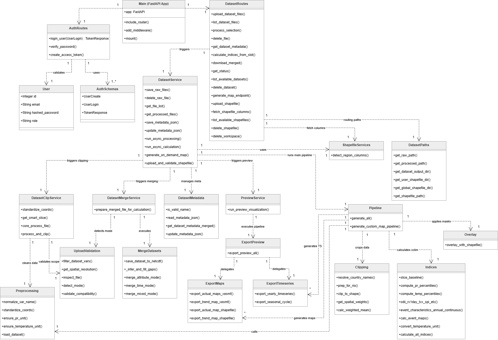

# Backend Architecture

The backend of the **Climate Data Services** application is built with **FastAPI**, serving as a high-performance, asynchronous engine for processing multi-dimensional climate datasets (NetCDF). The architecture is designed with a strict separation of concerns, ensuring efficient memory management for large-scale data handling and precise geospatial computations.

### Tech Stack & Core Libraries
- **Framework:** FastAPI
- **Climate & Math Processing:** `xarray`, `xclim`, `dask`, `numpy`
- **Geospatial Processing:** `geopandas`, `rioxarray`, `shapely`, `fiona`
- **Database & Auth:** PostgreSQL / SQLAlchemy, `passlib` (bcrypt), `python-jose` (JWT)

### Core Directory Structure
- `processing/`: The scientific core handling index calculations, spatial clipping, and GeoJSON/JSON generation.
- `services/`: Business logic, background tasks orchestration, and memory-efficient file management.
- `routes/`: RESTful API endpoints for frontend communication and authentication.
- `database/`: Database connection setup and SQLAlchemy ORM models.

```text
backend
├─ climate_app.db
├─ database
│  ├─ database.py
│  └─ models.py
├─ dependencies.py
├─ main.py
├─ processing
│  ├─ clipping.py
│  ├─ export_maps.py
│  ├─ export_preview.py
│  ├─ export_timeseries.py
│  ├─ indices.py
│  ├─ merge_datasets.py
│  ├─ overlay.py
│  ├─ pipeline.py
│  ├─ preprocessing.py
│  ├─ upload_validation.py
│  └─ __init__.py
├─ requirements.txt
├─ routes
│  ├─ auth_routes.py
│  └─ dataset_routes.py
├─ scripts
│  └─ create_user.py
└─ services
   ├─ dataset_clip.py
   ├─ dataset_merge.py
   ├─ dataset_metadata.py
   ├─ dataset_paths.py
   ├─ dataset_service.py
   ├─ preview_service.py
   └─ shapefile_services.py
```

### Architecture Overview
This class diagram illustrates the modular architecture of the backend, which is fundamentally divided into three distinct layers to ensure a clean **Separation of Concerns**:



1. **API Routes Layer (`routes/`):** The entry point of the system. It handles incoming HTTP requests from the frontend, validates user authentication, and delegates commands.
2. **Service Layer (`services/`):** The business logic orchestrator. It manages asynchronous background tasks, memory-efficient file I/O operations, and state/metadata management without performing heavy math.
3. **Processing Layer (`processing/`):** The core scientific engine. It executes all heavy lifting, including geospatial clipping, complex `xclim` index calculations, and converting arrays into frontend-ready GeoJSON formats.

###  Core Workflows (Sequence Diagrams)

To better understand the asynchronous nature and memory management of the backend, here are the Sequence Diagrams illustrating the two most critical data flows.

#### 1. Data Ingestion & Merging Flow
This workflow demonstrates how the backend handles large climate datasets safely. It uses **Chunked Uploads** to prevent RAM spikes and employs **Lazy Loading** with Dask to merge files out-of-core.


#### 2. Index Calculation & Map Export Flow
This complex workflow shows the asynchronous computation engine. It features the simplification of Shapefiles into cached GeoJSONs to optimize frontend rendering, followed by the rigorous calculation of `xclim` indices (Annual & Monthly passes) and the generation of spatial maps.


---

## Detailed Module Documentation
Below is an in-depth breakdown of each directory, its core responsibilities, and the specific functions within them.

# Processing Modules (processing/)
A comprehensive automated processing pipeline, from standardizing and merging raw data files, calculating indices and spatial statistics, to exporting frontend-ready results.

## processing/clipping.py
Clips spatial boundaries of multidimensional climate data using `rioxarray` and `geopandas` to fit target areas, and calculates area-weighted spatial means for irregular shapes.
### Functions
- **resolve_country_names :** Validates and returns alternative country names to ensure accurate shapefile matching.
- **prep_for_rio :** Prepares `xarray.DataArray` for processing by defining X/Y dimensions and setting the WGS84 (EPSG:4326) coordinate system.
- **clip_to_shape :** Clips the dataset strictly to the given Shapefile's polygon boundaries.
- **get_spatial_weights :** Creates a spatial weight matrix based on the intersection area between grid cells and actual geographic boundaries.
- **calc_weighted_mean :** Calculates the exact area-weighted mean using the formula Σ(Value * Area) / Σ(Area) for accuracy along borders.

## processing/export_maps.py
Generates spatial map layers by calculating statistical values (averages and trends) and converting data into GeoJSON FeatureCollections for frontend rendering.
### Functions
- **export_actual_maps_xesmf :** Calculates temporal averages, accurately generates grid bounds using `cf_xarray`, and exports as a grid-based GeoJSON.
- **export_trend_map_xesmf :** Performs a pixel-by-pixel Mann-Kendall statistical test to find long-term trends and exports as a grid-based GeoJSON.
- **export_actual_map_shapefile :** Calculates temporal averages from provincial time-series and maps them onto province polygons for GeoJSON export.
- **export_trend_map_shapefile :** Performs Mann-Kendall trend tests on provincial time-series and exports them alongside geometric boundaries.

## processing/export_timeseries.py
Extracts and aggregates spatial dimensions along the time axis into 1D arrays, exporting as lightweight JSON files for rendering line or bar charts (annual and monthly).
### Functions
- **export_yearly_timeseries :** Flattens data by calculating the spatial mean, groups by year, and exports annual data as JSON.
- **export_seasonal_cycle :** Calculates spatial means while preserving monthly resolution, skips missing values, and exports continuous monthly time-series.

## processing/export_preview.py
The pipeline controller for automatically generating preview data, from boundary clipping to exporting national and provincial maps and time-series.
### Functions
- **export_preview_all :** Controls the workflow: 1. Loads the Shapefile. 2. Clips boundaries to reduce RAM usage. 3. Resamples data frequency to annual and monthly. 4. Generates grid/polygon maps and time-series.

## processing/indices.py
The core engine for calculating all indices using `xclim` based on international standards, covering temperature, precipitation, SPI (droughts/floods), and extreme weather event detection algorithms.
### Functions
- **slice_baseline :** Safely extracts data based on the reference baseline period within the existing data range.
- **compute_pr_percentiles & compute_temp_percentiles :** Calculates historical percentiles used to determine extreme weather indices.
- **sdii, rx1day, txx, spi, etc. :** Wrapper functions calling `xclim` to calculate standard climate indices.
- **event_characteristics_annual_continuous :** Scans continuous SPI time-series to find the frequency, duration, peak, and severity of drought/flood events, grouped by year.
- **calc_event_maps :** Uses `xarray.apply_ufunc` with Dask to calculate event characteristics simultaneously across all pixels.
- **convert_temperature_unit :** Automatically checks and converts temperature units from Kelvin to Celsius (°C).
- **calculate_all_indices :** The orchestrator function that calculates all selected indices, manages baselines, and stores results in a single `xarray.Dataset`.

## processing/overlay.py
Refines spatial data by trimming grid cells that spill outside the country boundaries.
### Functions
- **overlay_with_shapefile :** Intersects GeoJSON files with the Shapefile to perfectly trim borders, reduces coordinate precision to optimize file size, and overwrites the file while preserving Metadata.

## processing/merge_datasets.py
Merges NetCDF files into a single `xarray.Dataset`, preventing Out-of-Memory (RAM) issues by using Dask Chunking and temporary disk writing.
### Functions
- **save_dataset_to_netcdf :** Saves temporary files by forcing chunk-by-chunk streaming (`compute=True`) to maintain constant RAM usage.
- **_infer_and_fill_gaps :** Sorts by time, checks frequency, and automatically fills missing time gaps.
- **merge_attribute_mode :** Merges datasets with matching spatial and temporal dimensions but different variables.
- **merge_time_mode :** Concatenates datasets of the same variable split across different time periods.
- **merge_mixed_mode :** Merges complex cases by concatenating the time axis for each variable first, then merging all variables together.

## processing/pipeline.py
The main orchestrator connecting the entire workflow (data preparation, clipping, calculation, exporting) into an automated pipeline linked to the API.
### Functions
- **generate_all :** The main processing pipeline upon data upload: 1. Loads data. 2. Clips national boundaries. 3. Calculates annual/monthly indices. 4. Loops to generate maps and time-series at national and provincial levels.
- **generate_custom_map_pipeline :** An On-demand map generation pipeline. It checks the cache first; if missing, it calculates only the requested index and boundary before applying overlays.

## processing/preprocessing.py
Performs Data Cleaning by converting variable names, coordinates, and units into a unified standard before processing.
### Functions
- **normalize_var_name :** Converts variable names to standard names using an alias table (e.g., "precip" to "pr").
- **standardize_coords :** Converts coordinate names to international standards (e.g., "lat" to "latitude").
- **ensure_pr_unit :** Automatically converts precipitation units to daily accumulation ("mm/day").
- **ensure_temperature_unit :** Automatically converts temperature units to Celsius (°C).
- **load_dataset :** Loads NetCDF/GRIB or CSV files and applies all the standardizing functions above before returning the dataset.

## processing/upload_validation.py
A "Lazy" upload validation checkpoint that reads only lightweight Metadata to analyze merging patterns and file compatibility.
### Functions
- **filter_dataset_vars :** Removes unused variables, keeping only system-allowed variables to reduce memory load.
- **get_spatial_resolution :** Extracts spatial resolution sequentially via `rioxarray`, ACDD Metadata, or coordinate calculation.
- **inspect_file :** Extracts key Metadata (file size, variables, coordinates, time) without loading data arrays into RAM.
- **detect_mode :** Analyzes whether the merge strategy should be Time, Attribute, or Mixed Mode.
- **validate_compatibility :** Evaluates if a batch of files can be safely merged, preventing calendar and resolution mismatch errors.

# API Routes & Endpoints Management (routes/)
The centralized FastAPI routers acting as a bridge between the Frontend and Backend, handling HTTP requests, authentication, and delegating background tasks.

## routes/auth_routes.py
Manages system security and Authentication, encrypting passwords with bcrypt and issuing JWTs for access control.
### Functions
- **login_user :** Validates passwords and returns a JWT Access Token containing user roles upon success.
- **Helper Functions :** Includes `verify_password` and `create_access_token`.
- **Pydantic Schemas :** Data validation models for incoming requests (UserCreate, UserLogin, TokenResponse).

## routes/dataset_routes.py
The primary API Router for dataset lifecycles, index calculations, interactive map generation, and server storage management.
### Functions
- **Raw File Management :** Uploads, views, and deletes files in temporary slots.
- **process_selection :** Receives commands and triggers a Background Task to merge raw files.
- **calculate_indices_from_slot :** Triggers index calculation in a Background Task based on Baseline and boundary conditions.
- **generate_map_endpoint :** Triggers On-demand map generation (Synchronous), blocking the response until the file is ready for the Frontend.
- **get_dataset_metadata :** Fetches `metadata.json` returning available variables, year ranges, and coordinates.
- **Shapefile Management :** Uploads boundary files, extracts column lists, and retrieves personal/global files.
- **Resource Deletion :** Safely deletes datasets or Workspaces.

## API Documentation

For detailed API specifications and integration guidelines, please refer to the complete API Documentation.

[**Read the full API Documentation (API_DOCS.md)**](API_DOCS.md)

# Backend Services & File Management (services/)
The centralized hub connecting the API, securely managing files and background tasks, handling Metadata, and analyzing Shapefiles efficiently (low RAM) prior to scientific calculation.

## services/dataset_clip.py
Clips spatial and temporal boundaries from raw NetCDF files using Lazy Evaluation to prevent RAM overload.
### Functions
- **standardize_coords :** Normalizes coordinate names to international standards.
- **get_smart_slice :** Intelligently checks coordinate order (ascending or descending) to generate correct slice commands.
- **core_process_file :** Clips data, converts units, removes unused variables, and writes to temporary NetCDF4 files.
- **process_and_clip :** Loops to read and clip all files, immediately freeing RAM via Garbage Collector after each file.

## services/dataset_merge.py
Merges clipped temporary files together and manages the deletion of junk files to free up system storage.
### Functions
- **prepare_merged_file_for_calculation :** Checks merge modes, concatenates data into `merged.nc`, moves it to the main `output/` directory, and deletes temporary files.

## services/dataset_metadata.py
Scans `merged.nc` to generate `metadata.json`, allowing the Frontend to check available variables.
### Functions
- **is_valid_name :** Filters and removes "unknown" or empty string values.
- **read_metadata_json :** Safely loads and reads `metadata.json` as a Python Dictionary.
- **get_dataset_metadata_merged :** Extracts variables, boundaries, year ranges, calendars, and checks resolution (tagging irregular grids with "~").

## services/dataset_paths.py
Defines all file paths in the backend, organizing and isolating user data.
### Functions
- **get_raw_path :** Returns the path for raw uploaded files.
- **get_processed_path :** Returns the path for clipped files.
- **get_dataset_output_dir :** Returns the path for final results.
- **get_user_shapefile_dir & get_global_shapefile_dir :** Manages paths for personal and global Shapefiles.
- **get_shapefile_path :** Searches for `.shp`/`.geojson` files, checking the user folder before the global directory.

## services/preview_service.py
Runs in the background to generate preview data for basic variables, allowing users to view overviews immediately after merging.
### Functions
- **run_preview_visualization :** Checks for redundancy; if none, loads `merged.nc` and triggers the export pipeline to create JSON/GeoJSON previews.

## services/shapefile_services.py
Toolkit for reading Shapefiles with low RAM consumption.
### Functions
- **detect_region_columns :** Uses `fiona` to read only the Schema/Properties, filters text columns, and automatically suggests columns likely representing area names.

## services/dataset_service.py
The core service facade of the backend, handling file/dataset uploads, dispatching background tasks, and updating Metadata.
### Functions
- **save_raw_files & upload_and_validate_shapefile :** Uploads files (Raw/Shapefile) in chunks to prevent RAM spikes, enforces strict size limits, safely extracts Zips, and validates required components (.shp, .shx, .dbf, .prj).
- **update_metadata_json :** Updates `metadata.json` by merging new data without duplication and ordering indices according to the standard (`MASTER_ORDER`).
- **run_async_processing :** Post-upload background task; queues boundary clipping, file merging, Metadata extraction, and immediate temp folder deletion.
- **run_async_calculation :** Climate index calculation task; simplifies Shapefile coordinates into a small `boundary.geojson` cache for fast Frontend loading, then runs the calculation pipeline.
- **generate_on_demand_map :** Generates maps for specific years on-demand; blocks API response until file creation completes so the Frontend can render it immediately.