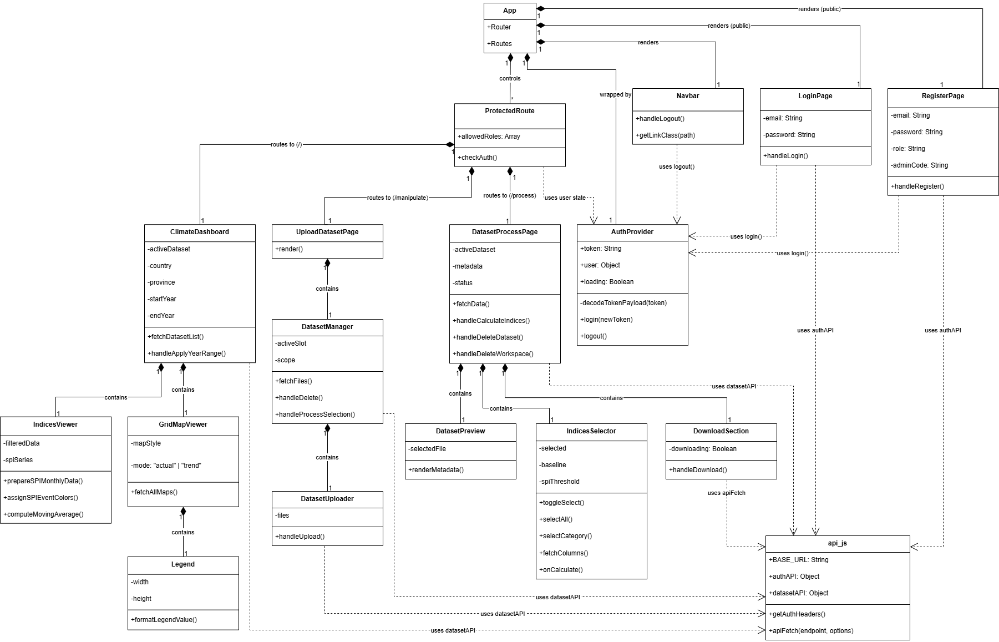

# Frontend Architecture

The frontend system for the climate data management and visualization platform. Built with **React** (via Vite) and styled using **Tailwind CSS**. It supports interactive spatial mapping (Leaflet & D3.js), statistical data charting (Recharts), and manages the complete workflow for NetCDF dataset uploading and preparation.

---

## Project Structure
```
frontend
├─ public
│  └─ vite.svg
├─ src
│  ├─ assets
│  │  └─ react.svg
│  ├─ components
│  │  ├─ DatasetManager.jsx
│  │  ├─ DatasetPreview.jsx
│  │  ├─ DatasetUploader.jsx
│  │  ├─ DownloadSection.jsx
│  │  ├─ GridMapViewer.jsx
│  │  ├─ IndicesSelector.jsx
│  │  ├─ IndicesViewer.jsx
│  │  ├─ Legend.jsx
│  │  ├─ Navbar.jsx
│  │  └─ ProtectedRoute.jsx
│  ├─ contexts
│  │  └─ AuthContext.jsx
│  ├─ pages
│  │  ├─ ClimateDashboard.jsx
│  │  ├─ DatasetProcessPage.jsx
│  │  ├─ LoginPage.jsx
│  │  ├─ RegisterPage.jsx
│  │  └─ UploadDatasetPage.jsx
│  ├─ services
│  │  └─ api.js
│  ├─ App.css
│  ├─ App.jsx
│  ├─ index.css
│  └─ main.jsx
├─ eslint.config.js
├─ index.html
├─ package-lock.json
├─ package.json
├─ postcss.config.js
├─ tailwind.config.js
└─ vite.config.js
```

### Component Architecture (Frontend Class Diagram)
The diagram below illustrates the architectural structure and dependencies among the system's components. It provides a clear overview of how Pages compose Sub-components and how they interact with Global Contexts and API Services.



---

## Module Documentation
The frontend is divided into core modules based on feature groups to ensure easy scalability and maintenance. The functional details and core logic of each module are described below:

## Application Root & Routing (src/App.jsx & src/main.jsx)
The entry point and main routing hub of the system. `main.jsx` mounts the React application to the DOM (Document Object Model), while `App.jsx` defines navigation routes via `react-router-dom` and manages access permissions based on user roles.
### Functions
- **Layout Setup :** Manages the main layout structure by locking the Navbar to always display at the top.
- **Public Routes :** Keeps the `/login` page open as a public route for authentication.
- **ProtectedRoute :** Restricts route access. The `/` (Dashboard) is accessible to both 'viewer' and 'analyst', while `/manipulate` and `/process` are strictly reserved for the 'analyst' role.

## Navbar (src/components/Navbar.jsx)
The main Navigation Bar that dynamically adjusts its layout and menus based on the user's role.
### Functions
- **Auto-hide :** Does not display on the `/login` and `/register` pages.
- **Role-Based Menu :** The "Manipulate" and "Process" menus are shown only to users logged in with the 'analyst' role.
- **getLinkClass :** Checks the current page to apply an active CSS class to highlight the menu currently in use (Active state).
- **handleLogout :** Clears session data and redirects the user back to the home page.

# Authentication Module
## Auth Context (src/contexts/AuthContext.jsx)
A React Context for managing global login states across the system. It stores the JWT Token, user Role, and authentication status so that various components can easily verify permissions.
### Functions
- **decodeTokenPayload :** Decodes the Base64 payload of the JWT to extract the user ID and role without relying on external libraries.
- **AuthProvider :** The main component wrapping the application to distribute State.
- **useEffect :** Checks for and restores any existing Token in `localStorage` when the web page is opened.
- **login :** Saves the Token to `localStorage`, updates the state, and decodes the payload to save the user's role.
- **logout :** Clears session data, removes the Token, and resets all states.

## Login Page (src/pages/LoginPage.jsx)
The login interface allowing users to enter their email and password to access the platform.
### Functions
- **handleLogin :** Sends the email and password to the API. Upon success, it uses the received Token to update the system state, redirects to the Dashboard, and handles Error notifications.

## Register Page (src/pages/RegisterPage.jsx)
The User Interface for creating a new account. It supports role-based registration, where the 'Analyst' level requires an Admin Code to verify privileges.
### Functions
- **handleRegister :** Validates password matching and the Admin Code, then sends the account creation data. Upon success, it automatically logs the user in and redirects to the workspace.

## API Service (src/services/api.js)
The central API client for handling HTTP Requests, automatically attaching Headers, and standardizing Error notifications.
### Functions
- **getAuthHeaders :** Retrieves the JWT Token to construct the Header.
- **apiFetch :** A wrapper around the `fetch` command. It automatically attaches Headers, correctly handles `FormData`, and clears the Token if a 401 Unauthorized status is encountered.
- **authAPI & datasetAPI :** Sets of pre-defined functions for authentication and climate dataset operations.

## Protected Route (src/components/ProtectedRoute.jsx)
A Route Guard that protects web pages by verifying login status and user roles before granting access.
### Functions
- **Access Control :** Checks the state from `AuthContext`. If not logged in, it redirects to `/login`. If the role privilege is insufficient, it redirects immediately back to the Dashboard.

# Dashboard Module
## Climate Dashboard (src/pages/ClimateDashboard.jsx)
The main data visualization page. It acts as a central hub for users to select datasets, areas (country/province), and indices. It manages all core States (like year ranges or area data) and passes them (Props) to child components like the map (GridMapViewer) and charts (IndicesViewer).
### Functions
- **useEffect (activeDataset) :** Triggered when the dataset changes. Fetches the dataset's `metadata.json` to read available Workspaces, variables, and data year boundaries.
- **useEffect (country) :** Triggered when the country/workspace changes. Synchronizes Shapefile settings, updates the available province list, and displays indices specifically calculated for that area in the Dropdown.
- **handleApplyYearRange :** Validates the user's year input, preventing the start year from exceeding the end year, and automatically clamps the year range to actual data limits before updating the graphs and maps.
- **fetchDatasetList :** Fetches the list of all available datasets in the system from the Backend via `datasetAPI` to display in the Dropdown.

## Indices Viewer (src/components/IndicesViewer.jsx)
Generates dynamic Timeseries charts using `recharts`. Intelligently switches between Bar Charts (for SPI events) and Line Charts (for standard annual/seasonal data) based on the selected index.
### Functions
- **prepareSPIMonthlyData & assignSPIEventColors :** Processes monthly SPI data and applies a coloring algorithm. Highlights prolonged dry spells in red and wet spells in blue if severity exceeds the Threshold for 2 or more consecutive months.
- **computeMovingAverage :** A mathematical function that calculates a moving average (default 21 years) to reduce annual volatility and clearly display long-term trends on the Line Chart.
- **Data Fetching (useEffect) :** Concurrently requests Annual and Seasonal JSON data files from the Backend (`Promise.all`).
- **Dynamic Rendering :** If the index belongs to the "SPI" group, it renders a Bar Chart with Threshold reference lines. Standard indices are rendered as Annual Line Charts overlaid with a moving average, alongside a 12-month Seasonal Cycle chart.

## Grid Map Viewer (src/components/GridMapViewer.jsx)
The most complex visual component of the system. Renders interactive maps via `react-leaflet`, converting climate data into visual layers using `D3.js`. Supports toggling between Actual and Trend modes and features a smart data loading mechanism that commands the Backend to generate map files if none are found.
### Functions
- **MapBoundsController :** Automatically calculates boundaries and zooms the camera to the selected province or country.
- **BoundaryLayer & CountryContextLayer :** Draws boundary lines and dims the surrounding outer areas to visually highlight the target region.
- **fetchAllMaps :** Fetches GeoJSON files. Crucial logic: If a 404 (Not Found) is returned, it triggers `/maps/generate` to wake the Backend to instantly generate the map, then re-fetches the data.
- **D3 Color Scaling :** Calculates Quantiles (excluding extreme outliers) to create color Thresholds and applies D3 color schemes (e.g., Red for temperature, Blue for rain) to the map grid.
- **style & onEachFeature :** Assigns grid colors and binds HTML Popups showing in-depth statistics (value, slope, p-value) upon clicking.
- **SigPoint :** Filters areas where p-value < 0.05 (statistically significant) and overlays black dots as markers.

## Legend (src/components/Legend.jsx)
A responsive SVG color scale Legend that adapts to screen size, modifying numbers and formats based on the current map data.
### Functions
- **ResizeObserver Effect :** Listens to window resizing to calculate and draw the SVG to always fit the screen perfectly (Responsive).
- **formatLegendValue :** A smart number formatting function that rounds decimals appropriately (e.g., dropping decimals for "days", forcing 2-4 decimals for SPI values).
- **SPI Event Logic :** If displaying SPI event trends, the system skips the gradient bar and renders categorical color boxes (Red/Gray/Blue) instead.

# Manipulate Page Module
## Upload Dataset Page (src/pages/UploadDatasetPage.jsx)
The structural page layout for managing raw dataset uploads. It sets up the Layout, Title, and Description, and delegates the complex upload logic to the `DatasetManager` component.
### Functions
- **UploadDatasetPage :** The main component that renders the web page structure and calls `DatasetManager`.

## Dataset Manager (src/components/DatasetManager.jsx)
The core control panel for managing datasets before processing. Allows users to switch slots (Preset 1-4 / Shapefile), view uploaded files, define the clipping Scope (spatial and temporal), and initiate the merging process.
### Functions
- **fetchFiles :** Fetches the list of uploaded files (NetCDF or Zip) pending in the system from the Backend based on the currently selected Slot.
- **handleDelete :** Displays a confirmation prompt and sends a command to delete the specified file from the system.
- **handleProcessSelection :** Validates the form, correctly handles Scope data types (converting empty Scope values to `null`), and sends a command to the Backend to begin merging and clipping data.

## Dataset Uploader (src/components/DatasetUploader.jsx)
A specialized component managing file selection and uploading. It prevents exceeding file size limits and prepares `FormData` to send to the server.
### Functions
- **handleUpload :** Checks that the total file size does not exceed the limit (1GB) to prevent server crashes. Prepares data (Shapefiles are sent as single .zip files, NetCDFs as file arrays) and uploads them via the API.

# Process Page Module
## Dataset Process Page (src/pages/DatasetProcessPage.jsx)
The data preparation control center. Users can view Metadata of uploaded datasets, load/delete datasets or workspaces, download merged NetCDF files, and command the Backend to calculate new climate indices (like SPI). Includes safety systems to prevent the deletion of protected system datasets.
### Functions
- **useEffect (activeDataset) :** Resets states and calls `fetchData()` when the dataset is changed.
- **fetchData :** Fetches Metadata from the Backend to display variables and dimensions.
- **handleCalculateIndices :** Gathers all settings and sends a POST Request to the Backend to calculate indices, navigating to the Dashboard upon successful initiation.
- **Status Polling (useEffect) :** Continuously polls the Backend every 2 seconds to check processing status until it turns 'ready' or 'error'.
- **handleDeleteDataset & handleDeleteWorkspace :** Sends DELETE commands to the Backend. These buttons are disabled for protected system datasets/workspaces to prevent accidental deletion.

## Download Section (src/components/DownloadSection.jsx)
Manages the downloading of merged and clipped NetCDF files, verifying data readiness status and preventing duplicate download clicks.
### Functions
- **handleDownload :** Triggered when the user clicks download. Sends a GET command to the Backend, converts the returned data to a Blob, creates a temporary URL, and simulates a link click to force the browser to download the file.

## Dataset Preview (src/components/DatasetPreview.jsx)
Displays the Metadata details of successfully merged datasets, allowing users to verify data accuracy before calculating indices.
### Functions
- **Render Metadata :** Parses the JSON Metadata and sorts it into easy-to-read categories: Variables, Dimensions, Spatial Coverage, and Temporal Coverage.

## Indices Selector (src/components/IndicesSelector.jsx)
A comprehensive configuration panel for index calculation. Allows users to select Shapefile boundaries, Baseline years, SPI Thresholds, and the desired climate indices.
### Functions
- **useEffect (availableVars) :** Groups raw variables from the file (e.g., pr, tmax) and matches them with computable standard indices (e.g., PRCPTOT, TXx).
- **toggleSelect, selectAll, selectCategory :** Functions to manage checking/unchecking of indices individually, by category, or all at once.
- **fetchColumns :** Automatically fetches column data from the Shapefile, allowing the user to select the column specifying sub-areas (e.g., province names).
- **onCalculate :** Gathers all configuration data from the form and passes it to the Parent component (`DatasetProcessPage`) to execute the Backend command.